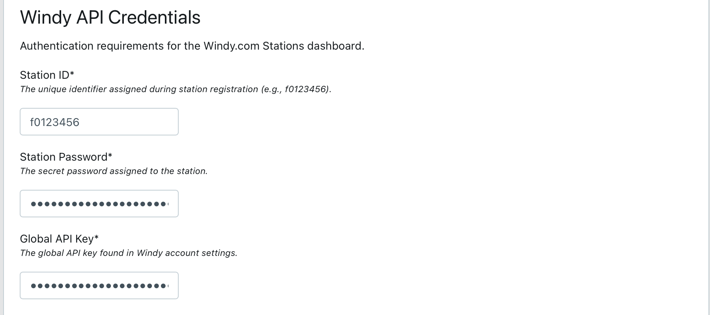
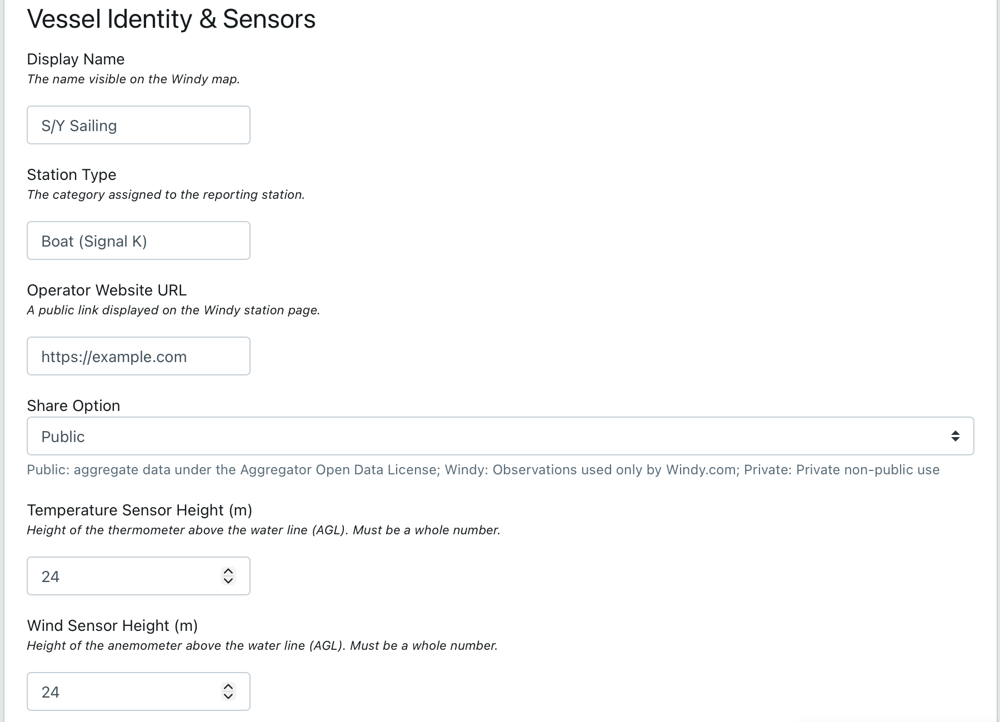
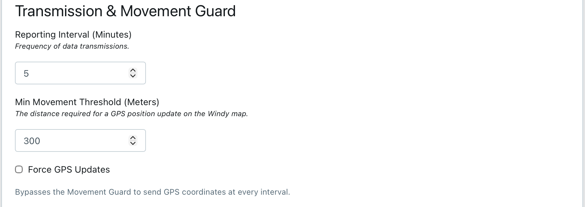
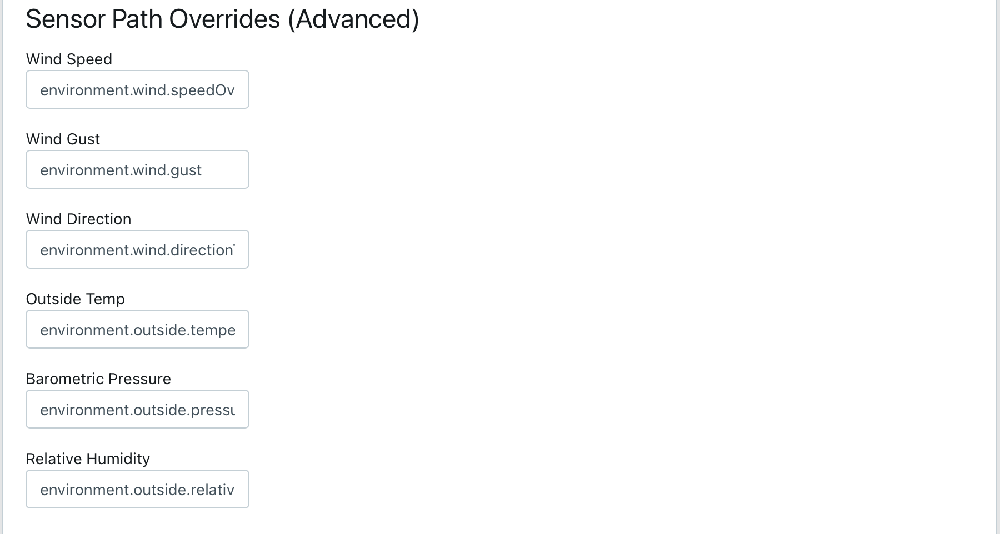
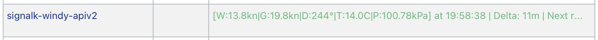
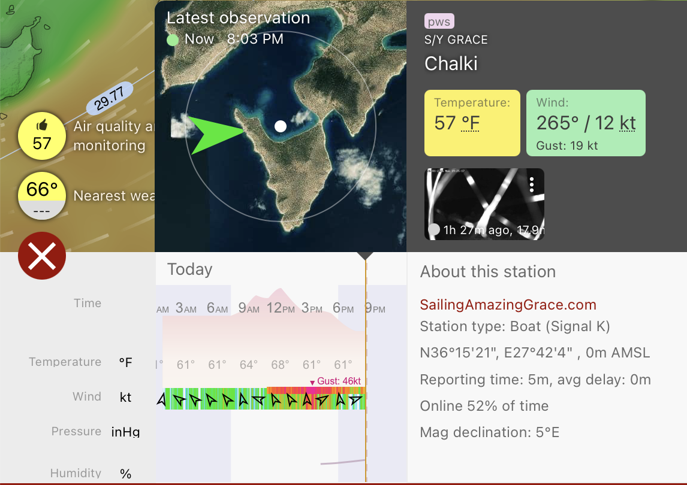

# Signal K Windy API v2 Reporter


This plugin gathers environmental data from a Signal K server and reports it to Windy.com as a Personal Weather Station (PWS) using the **v2 API**. It is designed specifically for moving vessels, utilizing separate endpoints for data (Wind, Gusts, Temperature, Pressure, and Humidity) and station metadata to ensure reliable map updates and minimal bandwidth usage.

## Project Status

Stable and actively maintained. See [CHANGELOG.md](CHANGELOG.md) for release history and [Issues](https://github.com/Peter-Petrik/signalk-windy-apiv2/issues) for planned work.

This is the only Signal K plugin targeting the Windy v2 API. Users of the legacy [signalk-windy](https://github.com/Saillogger/signalk-windy-plugin) plugin can follow the [Migration Guide](MIGRATION.md) to switch.

## Features

- **API v2 Compliance**: Uses the latest Windy protocol with separate `GET` (observations) and `PUT` (station management) requests.
- **Rate Limit Awareness**: (v1.3.0+) Handles Windy's 429 rate limit responses by rescheduling precisely to the provided `retry_after` window instead of discarding observations or reporting errors.
- **Live Heartbeat Status**: Enhanced dashboard feedback showing countdown to next report, distance from baseline, current sensor readings, and last submission time.
- **Radius-Based Movement Guard**: Intelligent GPS reporting that triggers map updates only when the vessel moves beyond a set radius from its last position, preventing "phantom movement" while at anchor.
- **Peak Gust Tracking**: Captures the highest wind speed reading at 1Hz between reporting intervals, ensuring short-lived gusts are not missed by the 5-minute reporting cycle.
- **State Persistence**: Remembers the movement baseline and reporting schedule across Signal K server restarts via `state.json`.
- **Smart Unit Conversion**: Automatically handles conversion from Signal K base units (Kelvin, Pascal, m/s) to Windy standards (°C, Pa, m/s).

## Mapped Data Paths

The plugin monitors the following Signal K paths to populate Windy observation reports. 
The internal keys are the actual parameters transmitted to the Windy API. Users can override these defaults in the plugin configuration:

| Windy Parameter | Signal K Path (Default) | Internal Key |
| :--- | :--- | :--- |
| Wind Speed | `environment.wind.speedOverGround` | `wind` |
| Wind Gust | `environment.wind.gust` | `gust` |
| Wind Direction | `environment.wind.directionTrue` | `winddir` |
| Temperature | `environment.outside.temperature` | `temp` |
| Pressure | `environment.outside.pressure` | `pressure` |
| Humidity | `environment.outside.relativeHumidity` | `rh` |
| Latitude | `navigation.position.latitude` | `lat` |
| Longitude | `navigation.position.longitude` | `lon` |

## Prerequisites

- **Windy API Key**: A valid API key and Station ID from [stations.windy.com](https://stations.windy.com).
- **Position Data**: A valid GPS source providing `navigation.position`.
- **Derived Data (Optional)**: For vessels without direct SOG or True Wind sensors, the `signalk-derived-data` plugin is recommended to provide the necessary calculated paths.

## Quick Start Guide

1. **Register the Station**: Log in to [stations.windy.com](https://stations.windy.com) and click **+ Add Station**.
2. **Collect Credentials**: 
   * Retrieve your **API Key** from the "API Keys" section.
   * Retrieve your **Station Password** from the station details.
   * Retrieve your **Station ID** (e.g., `f0123456`) from the station list.
3. **Configure the Plugin**:
   * Open the Signal K console.
   * Navigate to **App Store > Available** and install `signalk-windy-apiv2`.
   * Go to **Server > Plugin Config** and enter your credentials.
   * Set your **Station Name** (this will appear on the Windy map).
4. **Set Movement Guard**: Choose a distance threshold (default 300m). The station position on Windy will only update when the vessel moves beyond this distance from the last reported point.

Migrating from the legacy signalk-windy plugin? See the [Migration Guide](MIGRATION.md).

## Technical Details

### Real-Time Log Monitoring
To stream logs specifically for this plugin:
```bash
journalctl -u signalk-server -f | grep "signalk-windy-apiv2"
```

### Manual Reset
To clear the persistent state (for example, to reset the movement baseline or force an immediate timer restart):

1. Open the Signal K **Dashboard**.
2. Navigate to **Server > Plugin Config**.
3. Select the **Windy API v2 Reporter** from the list.
4. Click the **Submit** button at the bottom of the configuration page.

Settings do not need to change; clicking "Submit" triggers the plugin to stop and restart, which clears the session cache and re-initializes all trackers.

### Diagnostic Reporting
To generate a log summary for troubleshooting:

```bash
journalctl -u signalk-server -n 100 --no-pager | grep "signalk-windy-apiv2"
```

When sharing logs, redact the **Station Password** and **API Key** before posting to public forums or GitHub issues.

## Future Enhancements

* **Precipitation Support**: The Windy API v2 accepts a `precip` parameter for rain in mm for the last 60 minutes. With access to a rain gauge providing the appropriate Signal K path, this would extend the reported data set.

* **Offline Observation Queue**: Buffer observations when connectivity is unavailable and replay them when the connection returns, using the confirmed `ts` parameter for backdated submissions.

* **Data Staleness Detection**: Flag sensor readings that have not updated within a configurable window and optionally omit them rather than reporting stale data.

## Support

For bug reports and feature requests, open an issue at [GitHub Issues](https://github.com/Peter-Petrik/signalk-windy-apiv2/issues). Include the Signal K server version, plugin version, and relevant log output (see Diagnostic Reporting above).

Contributions are welcome — see [CONTRIBUTING.md](CONTRIBUTING.md) for guidelines.

## Screenshots

### Plugin Configuration





### Live Dashboard Heartbeat


### Vessel on Windy Map


## License

Copyright 2026 Peter Petrik. Licensed under the [Apache-2.0 License](LICENSE).
